# 对话流程 v1.4 (基于 generated-page-v1.6_en.html)

本版本文档基于 `sales_agent_v1.1/generated-page-v1.6_en.html` 的实际交互界面和 `docs/dialog_flow._v1.3.md` 的技术策略进行重构与更新。旨在提供一份与前端实现完全对齐的、详尽的对话流程说明。

---

## 1. 核心目标

- **流程对齐**：确保文档描述的步骤与 `data-step` 属性定义的视图完全一致。
- **逻辑详实**：清晰阐述每个步骤的用户输入、系统行为、分支逻辑和关键 UI 元素。
- **策略继承**：整合 v1.3 版本中关于分享、保存、留资和校验的核心策略。

---

## 2. 交互流程详解 (Step-by-Step)

以下流程根据 `generated-page-v1.6_en.html` 中的 `data-step` 属性进行分解。

### Step 1: 欢迎与地址输入 (`data-step="1"`)

- **视图**: 欢迎卡片，包含标题、描述和地址输入框。
- **用户操作**:
  1.  在 `#addressInput` 中输入家庭住址。
  2.  (可选) 点击 `#useLocationBtn` 自动填充当前位置。
  3.  点击 `#startExploreBtn` 提交地址。
- **系统逻辑**:
  - 地址输入框 `#addressInput` 的内容长度少于 6 个字符时，`#startExploreBtn` 按钮处于禁用状态 (`disabled`)。
  - 输入满足条件后，按钮激活。
  - 点击按钮后，系统验证地址并进入下一步。
- **失败处理**:
  - 若地址无效或无法解析，显示 `#addrError` 提示。

### Step 2: 地图屋顶确认 (`data-step="2"`)

- **视图**: 显示一个交互式地图 (`#mapViewport`)，并在地图上高亮显示一个或多个可能的屋顶区域 (`#roofOverlay`)。
- **用户操作**:
  1.  在地图上拖动、缩放 (`#zoomIn`, `#zoomOut`) 来定位自己的屋顶。
  2.  点击地图上正确的屋顶区域进行选择。
  3.  点击 `#confirmRoofBtn` 确认选择。
  4.  (可选) 点击 `#backTo1` 返回上一步修改地址。
- **系统逻辑**:
  - 用户选择一个屋顶区域后，`#confirmRoofBtn` 按钮激活。
  - 确认后，系统记录屋顶的地理位置和几何信息，进入分析阶段。

### Step 3: AI 分析 (`data-step="3"`)

- **视图**: 一个过渡动画页面，显示系统正在进行的分析任务列表。
- **系统逻辑**:
  - 这是一个自动进行的步骤，用于模拟或执行后端分析，例如：
    - `Analyzing roof area` (分析屋顶面积)
    - `Evaluating sun exposure` (评估日照情况)
    - `Scanning high-consumption devices` (扫描高功耗设备)
  - 分析完成后，自动进入下一步。
- **超时处理**: 若分析时间过长（例如超过 8-15 秒），可跳转至下一步并使用一套保守的默认参数生成方案。

### Step 4: 3D 模型与方案概览 (`data-step="4"`)

- **视图**: 显示分析完成后的 3D 屋顶模型 (`#viewer3d`) 和多个定制方案的迷你卡片 (`#schemesStrip4`)。
- **用户操作**:
  1.  拖动 3D 模型进行查看。
  2.  点击不同的方案卡片（如 `Smart Saver`, `High Efficiency`）来切换 3D 模型上光伏面板的布局和对应的预算信息。
  3.  点击 `#s4RefineBtn` 进入留资表单 (Step 7)。
  4.  点击 `#s4ShareBtn` 或 `#s4SaveImgBtn` 进行分享或保存。
- **系统逻辑**:
  - 默认选中第一个方案 (`smart`)。
  - 切换方案时，会更新 `#s4BudgetPanel` 中的预算范围、系统大小、回报周期等信息。
  - **保存图片**: 点击 `#s4SaveImgBtn` 时，使用 `html2canvas` 等库将 `#s4BudgetPanel` 区域生成为一张 PNG 图片并下载。

### Step 5: 方案交互 (`data-step="5"`)

- **视图**: 提供一个更大的 3D 视图 (`#viewer5`) 和更详细的方案选择卡片。
- **用户操作**:
  1.  点击四个方案卡片中的任意一个。
  2.  点击 `#backTo4` 返回上一步。
- **系统逻辑**:
  - 点击方案卡片后，`#house3dStep5` 中的 3D 效果会更新，展示对应方案的光伏面板数量和电池（如果方案包含）。
  - 选择一个方案后，通常会引导用户进入下一步查看详细价值或直接留资。

### Step 6: 价值呈现 (`data-step="6"`)

- **视图**: 针对在 Step 5 选中的方案，展示其详细的经济价值，包括系统预算、回报周期、自用比例等。
- **用户操作**:
  1.  点击 `#openLeadBtn` 打开留资模态框 (Step 7)。
  2.  点击 `#backTo5` 返回方案选择页面。
- **系统逻辑**:
  - 此页面聚合了最终的价值信息，是引导用户留资的关键转化点。

### Step 7: 线索捕获 (留资模态框) (`id="leadModal"`)

- **视图**: 一个模态框表单，用于收集用户信息。
- **用户操作**: 填写姓名 (`#leadName`)、电话、邮箱等信息，并提交。
- **系统逻辑 (继承 v1.3)**:
  - **字段**: `name`, `phone`, `email`, `postcode`, `consent`。
  - **校验规则**: 
    - 姓名、电话、邮箱满足“三选二”即可提交。
    - `postcode` 需要是 4 位数字。
    - `consent` (同意隐私条款) 必须勾选。
  - 提交成功后，向后端发送线索数据，并向用户显示成功提示。

---

## 3. 分享与保存策略 (继承 v1.3)

- **分享模态框 (`#shareModal`)**: 
  - 通过 `#s4ShareBtn` 或 `#shareQuoteBtn` 触发。
  - **URL 来源**: 始终使用 `location.href` (当前页面 URL)。
  - **原生分享**: 调用 Web Share API 分享“摘要文本 + URL”。
  - **复制链接**: 仅复制 URL。

- **复制报价 (`#copyQuoteBtn`)**: 
  - 复制“方案摘要文本 + 当前页面 URL”到剪贴板。

- **保存图片 (`#s4SaveImgBtn`)**: 
  - 将 `#s4BudgetPanel` 元素渲染成 PNG 图片并触发下载。
  - 文件名建议包含方案名称和时间戳，例如 `Smart_Saver_Quote_20250901.png`。

---

## 4. 状态机与事件埋点 (建议)

### 4.1 状态机流程（用户视角）

- START：进入页面或唤起对话，系统准备就绪。
- STEP_1_INPUT：你输入/校验地址或地块范围。
- STEP_2_CONFIRM：你确认屋顶/区域定位与轮廓。
- STEP_3_ANALYSIS：系统计算可铺设面积、光照与产能。
- STEP_4_OVERVIEW：系统给出多种方案对比（如不同容量/组件品牌）。
- STEP_5_INTERACT：你在方案里切换参数、查看细节、分享、保存图片等。
- STEP_6_VALUE：你打开留资/咨询表单，确认价值点。
- STEP_7_LEAD：你提交留资，系统返回成功/失败。
- END：完成一次会话（可能是自然结束、或跳转到厂商工具页）。

说明：每个 STEP 都是用户容易理解的阶段节点；在节点内会触发相应埋点事件。某些分支会跳过中间步骤（见 4.3）。

### 4.2 关键事件埋点（何时触发，带什么）

- step1_submit_address
  - 触发：地址或范围提交成功后（进入分析前）。
  - 参数：address, geo_hash/lat_lng, source, session_id。
- step2_confirm_roof
  - 触发：你确认屋顶/区域轮廓。
  - 参数：roof_polygon_area_m2, roof_quality(OK/adjusted), session_id。
- step4_view_plans
  - 触发：系统首次展示方案概览页。
  - 参数：plans_count, default_plan_name, session_id。
- step4_select_plan
  - 触发：你点击/切换某个方案卡片。
  - 参数：plan_name（必填）, capacity_kw, est_yearly_kwh, price_range, session_id。
- step4_action_share / step4_action_copy / step4_action_save_image
  - 触发：点击分享/复制链接/保存图片。
  - 参数：plan_name, share_channel(wechat/link/…), image_resolution, session_id。
- step6_open_lead_form
  - 触发：你打开留资或咨询表单。
  - 参数：entry_point(overview/cta/sticky_bar/auto_jump), vendor, session_id。
- step7_submit_lead_success / step7_submit_lead_fail
  - 触发：提交留资成功/失败。
  - 参数（成功）：lead_id, vendor, plan_name, contact_masked, session_id。
  - 参数（失败）：error_code, vendor, plan_name, session_id。

建议：事件名保持上述固定命名。每次事件均带 session_id、route、vendor（如可判定）、ts（时间戳）。对频繁交互（如方案卡切换）做节流/去抖（例如 300ms）。

### 4.3 分支情况（跳转与特殊路径）

- 面积超大，直接跳到专属留资卡片
  - 判定：roof_polygon_area_m2 ≥ 阈值（如 ≥ 3000 m²，可配置）。
  - 流转：STEP_3_ANALYSIS 完成后，跳过 STEP_4/5，直接至 STEP_6_VALUE。
  - 埋点：
    - 不触发 step4_view_plans（未进入概览）。
    - 触发 step6_open_lead_form，entry_point=auto_jump, reason=oversize。

- 识别到已有光伏，进入“储能方案”流程
  - 判定：图像/瓦片识别 existing_pv=true。
  - 流转：STEP_3_ANALYSIS 后分岔到“储能方案概览”（STEP_4_OVERVIEW 的 storage 变体）。
  - 埋点：
    - step4_view_plans：plan_type=storage，plans_count。
    - step4_select_plan：plan_type=storage，记录储能容量 kWh、放电功率 kW、可用时长 h。

- 不同厂商的专属营销工具 URL（跳出或内嵌）
  - 规则：根据 vendor（如 VendorA/VendorB）与 plan_type（pv/storage/hybrid）拼接目标 URL；深链优先，失败回退到通用落地页。
  - 示例（示意）：
    - VendorA：https://vendorA.com/tools?plan={plan_name}&utm={campaign}
    - VendorB：https://go.vendorB.cn/deeplink/{plan_id}?src={source}
  - 埋点：外跳前发送 step4_action_share 或自定义 step4_action_vendor_tool，参数含 vendor, tool_url, plan_name, plan_type, session_id。

### 4.4 参数与上下文（统一携带）

- 必带上下文：session_id, route, source(流量来源), vendor(若可识别), has_existing_pv, area_size_category(small/medium/large/oversize)。
- 方案参数：plan_name, plan_type(pv/storage/hybrid), capacity_kw, storage_kwh, est_yearly_kwh, price_range。
- 地理参数：address, lat_lng/geo_hash, region_code。
- 留资参数：lead_id(成功), error_code(失败), entry_point, contact_masked（如 +86****1234）。

### 4.5 事件序列示例（含分支）

- 常规光伏路径
  1) step1_submit_address
  2) step2_confirm_roof
  3) step4_view_plans
  4) step4_select_plan(plan_name="PV_6kW")
  5) step4_action_save_image
  6) step6_open_lead_form(entry_point=cta)
  7) step7_submit_lead_success

- 超大面积直接留资
  1) step1_submit_address
  2) step2_confirm_roof
  3) step6_open_lead_form(entry_point=auto_jump, reason=oversize)
  4) step7_submit_lead_success

- 识别到已有光伏，走储能方案
  1) step1_submit_address
  2) step2_confirm_roof(has_existing_pv=true)
  3) step4_view_plans(plan_type=storage)
  4) step4_select_plan(plan_name="ESS_10kWh")
  5) step6_open_lead_form
  6) step7_submit_lead_success

### 4.6 埋点数据示例

```json
{
  "event": "step4_select_plan",
  "ts": 1725212465,
  "session_id": "sess_abc123",
  "route": "flow_v1.4",
  "vendor": "VendorA",
  "context": {
    "address": "上海市徐汇区…",
    "lat_lng": [31.19, 121.43],
    "has_existing_pv": false,
    "area_size_category": "medium"
  },
  "plan": {
    "plan_name": "PV_6kW",
    "plan_type": "pv",
    "capacity_kw": 6,
    "est_yearly_kwh": 7200,
    "price_range": "28k-33k"
  },
  "utm": {
    "source": "wechat",
    "campaign": "q3_push"
  }
}
```

### 4.7 落地实践要点

- 事件去重：每个“首次进入页”类事件（如 step4_view_plans）单会话仅一次。
- 错误兜底：请求/识别失败抛出 stepX_error，含 error_code 与重试次数。
- URL 安全：外跳前校验 vendor 与白名单域名；对 plan_name 做 URL 编码。
- 隐私合规：联系方式仅存储脱敏版本，原始数据仅用于提交 API，不入埋点日志。

---
  
## 5. Chatbot 对话流程图 (Dify 风格)

以下是模拟 Dify 等平台设计的流程图，包含 LLM、工具调用和提示词等节点。

```mermaid
graph TD
    subgraph "智能销售代理对话流 (Dify-Style)"
        A(开始) --> B["机器人: 您好！请输入您的地址，开始探索太阳能潜力。"];
        B --> C{用户输入地址};
        
        C --> T1[["工具: 地址解析 (Geocoding API)"]];
        T1 -- 成功 --> T2[["工具: 获取卫星图像 (Imagery API)"]];
        T1 -- 失败 --> B_Retry["机器人: 地址无法识别，请您重试。"];
        B_Retry --> C;

        T2 --> D["机器人: 请在地图上确认您的屋顶位置。"];
        D --> E{用户确认屋顶};
        
        E --> T3[["工具: 屋顶分析 (图像识别模型)"]];
        T3 -- 分析结果(面积/朝向) --> L1(LLM: 生成太阳能潜力报告);
        %% Prompt for L1
        L1_Prompt["提示词配置 (L1):
        - 输入: 屋顶面积, 朝向, 日照数据
        - 指令: 根据输入数据，生成一份专业的太阳能潜力分析报告，并推荐4种安装方案(经济型, 高效型, 储能型, 旗舰型)。
        - 输出格式: JSON"];
        L1_Prompt -.-> L1;

        L1 -- 分析报告JSON --> G["机器人: 分析完成！这是您的3D模型和定制方案。"];
        G --> H{用户选择方案};

        H -- 选择方案名称 --> L2(LLM: 生成方案价值说明);
        %% Prompt for L2
        L2_Prompt["提示词配置 (L2):
        - 输入: 方案名称, 分析报告JSON
        - 指令: 根据用户选择的方案，生成详细的经济效益说明，包括预算范围、回报周期、自用率和年节省电费。
        - 输出格式: 文本"];
        L2_Prompt -.-> L2;

        L2 -- 价值说明文本 --> I["机器人: 这是您选择方案的详细价值预估。"];
        I --> J{用户请求报价};

        J --> K["机器人: 好的，为获取含补贴的最终报价，请您提供联系方式。"];
        K --> L{用户填写表单};
        
        L --> T4[["工具: 创建线索 (CRM API)"]];
        T4 -- 成功 --> M["机器人: 感谢！我们的顾问将很快与您联系。"];
        T4 -- 失败 --> M_Fail["机器人: 抱歉，提交失败，请稍后重试。"];
        M --> Z(结束);
        M_Fail --> K;
    end
```



